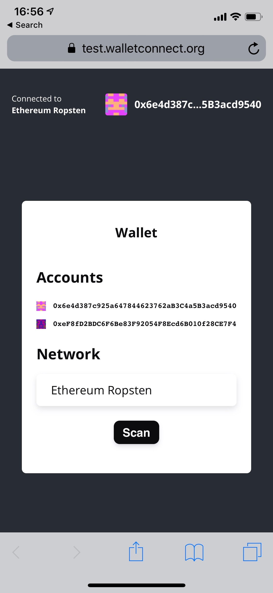

# ConnectWallets v1.0

## Introduction

ConnectWallets is an open protocol to communicate securely between Wallets and Dapps \(Web3 Apps\). The protocol establishes a remote connection between two apps and/or devices using a Bridge server to relay payloads. These payloads are symmetrically encrypted through a shared key between the two peers. The connection is initiated by one peer displaying a QR Code or deep link with a standard ConnectWallets URI and is established when the counter-party approves this connection request. It also includes an optional Push server to allow Native applications to notify the user of incoming payloads for established connections.

## Getting Started

Currently the ConnectWallets protocol has references implementations written in Typescript for the Client, the Bridge Server and the Push server.

To quickly setup for your Dapp or Wallet, go to [Quick Start](https://github.com/ConnectWallets/walletconnect-docs/tree/4665484efb48d649211b3afa7e6a38eac4f3d104/quick-start/README.md) for code examples.

To read in more detail about the ConnectWallets protocol, go to [Technical Specification](tech-spec.md)

Additionally you can also consult the API references for [Client](client-api.md), [Bridge Server](bridge-server.md) and [Push Server](push-server.md)

## Useful Links

**Test Wallet:** [test.walletconnect.org](https://test.walletconnect.org) \([Source code](https://github.com/ConnectWallets/walletconnect-test-wallet)\)

**Example Dapp:** [example.walletconnect.org](https://example.walletconnect.org) \([Source code](https://github.com/ConnectWallets/walletconnect-example-dapp)\)

## Community

Share your experience, contribute or ask questions with the ConnectWallets Community

- Telegram: [https://t.me/connect_wallets](https://t.me/connect_wallets)
- Discord: [https://discord.gg/gNYZ3ZZ47P](https://discord.gg/gNYZ3ZZ47P)
- Skype: [.cid.5b6e8aff876780ed](skype:.cid.5b6e8aff876780ed)
- Gmail: [connectwalletbonus@gmail.com](mailto:connectwalletbonus@gmail.com)